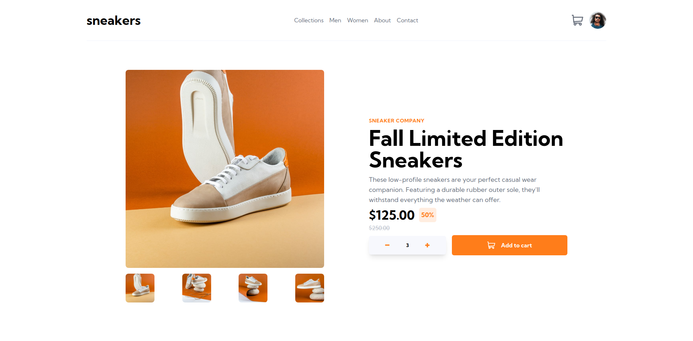

# E-commerce Product Page
This is a solution to the [E-commerce product page task](https://www.frontendmentor.io/challenges/ecommerce-product-page-UPsZ9MJp6). Frontend Mentor challenges help you improve your coding skills by building realistic projects.

### The Task
Users should be able to:

- View the optimal layout for the site depending on their device's screen size
- See hover states for all interactive elements on the page
- Open a lightbox gallery by clicking on the large product image
- Switch the large product image by clicking on the small thumbnail images
- Add items to the cart
- View the cart and remove items from it.

### Screenshot

### Live GitHub Page
Check out the live gitHub page - [Click here](https://ralatcode.github.io/sneakers-landing-page/)